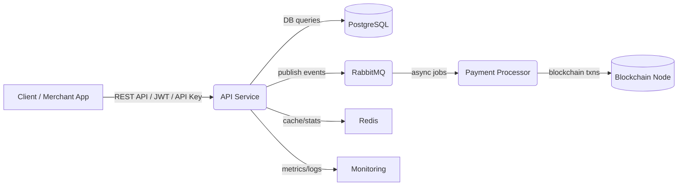

# Architecture Overview

PayCrypt is a modular, secure crypto payment system. It consists of:
- **API Service (Go/Gin):** Handles HTTP endpoints, authentication, business logic
- **Payment Processor:** Handles blockchain interaction and payment status
- **PostgreSQL:** Main database for merchants, transactions, payment links
- **RabbitMQ:** For asynchronous payment events and decoupling
- **Redis:** Caching/session storage
- **Monitoring/Logging:** Tracks health, errors, and analytics

**High-Level System Diagram:**

> For detailed architecture and editable diagrams, see [architecture.md](./architecture.md) and [diagrams/](./diagrams/).

> **Base URLs:**
> - Development: http://localhost:8080
> - Production: https://api.paycrypt.tech

> **Authentication:**
> - Most endpoints require either a JWT Bearer token or an API Key (see endpoint details).
> - Rate limiting is enforced per route.
> - Secure all credentials and never expose secrets publicly.